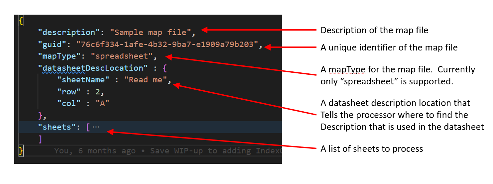
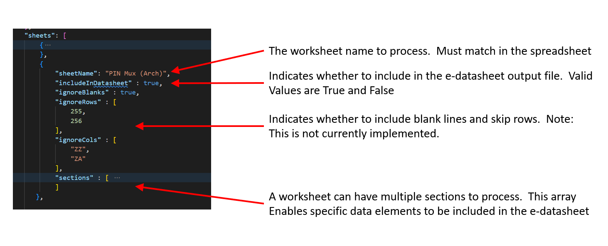
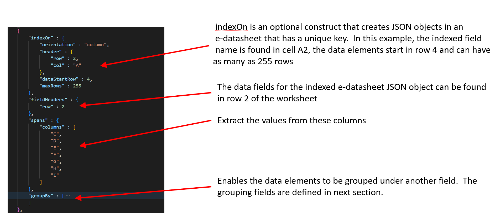
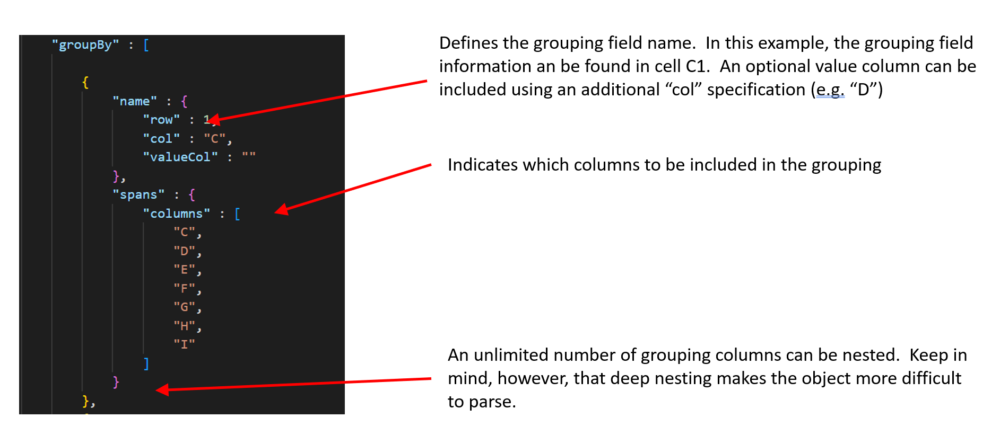

# Introduction 
Digital Datasheets Creator

[[_TOC_]]
# Architectural Tenets
A plugin based architecture has been used for the development of this tool. The architecture is based on the article [here](https://pythonhowtoprogram.com/a-plugin-architecture-for-using-importlib-in-python-3/?utm_source=dev.to&utm_medium=cp&utm_campaign=ctalink&utm_term=a-plugin-architecture-for-using-importlib-in-python-3)

# Developer Setup
## Getting started
Instructions here assume developers use VSCode for development. However, other IDEs will follow similar procedures.
1. [Download](https://git-scm.com/download/win) and install git
2. [Download](https://code.visualstudio.com/Download) and Install Visual Studio Code
3. Within Visual Studio Code, install python and json marketplace extensions using the "Extensions" button in the left nav bar.
4. As of date of publishing this guide, python 3.11 is the latest python distribution available [Download](https://www.python.org/downloads/) and Install Python 3.11 
5. [Download](https://www.geeksforgeeks.org/download-and-install-pip-latest-version/#windows) and Install PIP for Windows

> ⚠️ Warning
> 
> Please check your environment variables if you are using Windows.

6. If developing on Windows, [download](https://mlocati.github.io/articles/gettext-iconv-windows.html) and install the appropriate gettext and iconv binaries for your platform to produce localized strings.   For ease of configuration the [64-bit static library](https://github.com/mlocati/gettext-iconv-windows/releases/download/v0.21-v1.16/gettext0.21-iconv1.16-static-64.exe) is preferred since the tools can more easily be relocated on your system if needed.  
2. Install Python Virtual Environments with this command:
    ```
    pip install virtualenv
    ```
3. Create a source directory and cd into that directory.  Example:
    ```
    mkdir <directoryname>
    cd <directoryname>
    ```
4.  Clone the source repository with this command:
    ```
    git clone https://github.com/intel/digital-datasheet-creator.git
    ```
    
5.  Set up a virtual environment within the project directory type:
    ```
    python3 -m venv .venv
    ```
    This will create a virtual directory for the project where external package dependencies will be installed.  There is some good documentation on using virtual environments [here](https://www.geeksforgeeks.org/creating-python-virtual-environment-windows-linux/).  Visual Studio should recognize the virtual environments
6.  cd into the repository directory
7.  Now you need to activate your virtual environment for this you should run the following command:
    ```ps
    ".venv/Scripts/activate"
    ```
8.  Install the package dependencies using this command:
    ```ps1
    pip install -r requirements.txt
    ```
9.  Using Visual Studio Code, open the digital-datasheets-creator.code-workspace file
10. Create a new Terminal window by clicking on "Terminal + New Terminal" menu items or:
    ```
    Ctrl+Shift+`
    ```
11. For Windows, cd into the edatasheets_creator directory and type:
    ```
    py main.py 
    ```
    You should see an input file not found error because no command line arguments have been specified.  That's OK, just confirms that the environment is set up correctly.

12. Set up a launch.json file for debug by pressing the Run and Debug button on the left nav bar in Visual Studio Code and creating a launch.json if one does not already exist.  Here is an example launch.json (don't forget to change the paths to point to a sample file)
    ```json
    {
        // Use IntelliSense to learn about possible attributes.
        // Hover to view descriptions of existing attributes.
        // For more information, visit: https://go.microsoft.com/fwlink/?linkid=830387
        "version": "0.2.0",
        "configurations": [
             
            {
                "name": "Python: Current File",
                "type": "python",
                "request": "launch",
                "program": "${workspaceFolder}/edatasheets_creator/main.py",
                "console": "integratedTerminal",
                "justMyCode": true,
                "args": [
                    "--f",
                    "C:/Users/rehall/Downloads/GPIO/input.xlsx",
                    "--m",
                    "C:/Users/rehall/Downloads/GPIO/input-map.json"
                ]
            }
        ]
    }
    ```

# Developer considerations
In this section, guidelines are provided for adding code to the project. These guidelines are needed to ensure consistency.

## Naming Style
This code has it's own naming convention. You must consider the following table:

| **Type**  | **Naming convention**                                                                                     | **Examples**                 |
|-----------|-----------------------------------------------------------------------------------------------------------|------------------------------|
| Function  | Camel case, starting the first letter with lower case\.                                                   | myFunction\(\), function\(\) |
| Variable  | Camel case, starting the first letter with lower case\.                                                   | myVariable, variable         |
| attribute | Camel case, starting the first letter with lower case\.                                                   | myAttribute, attribute       |
| Class     | Camel case, start each word with a capital letter\.                                                       | MyClass, Class               |
| Method    | Camel case, starting the first letter with lower case\.                                                   | myMethod\(\), method\(\)     |
| Constant  | Use an uppercase single letter, word, or words\. Separate words with underscores to improve readability\. | MY\_CONSTANT, CONSTANT       |
| Module    | Camel case, starting the first letter with lower case\.                                                   | myModule\.py, module\.py     |
| Package   | Use a short, lowercase word or words\. Do not separate words with underscores\.                           | mypackage, package           |

In case to use private attributes or methods:

| **Type**  | **Naming convention**                                                          | **Examples**                     |
|-----------|--------------------------------------------------------------------------------|----------------------------------|
| attribute | Camel case, starting with one underscore and the first letter in lower case\.  | \_myAttribute, \_attribute       |
| Method    | Camel case, starting with two underscores and the first letter in lower case\. | \_\_myMethod\(\), \_\_method\(\) |

## Linting
The code must comply with Flake8 standard. For this reason, it is necessary to install in the code editor used an extension that helps with Flake8 compliance. You can also install [TOX](https://tox.wiki/en/latest/index.html) in the virtual environment and run it, it has the configuration to run Flake8 linter via command line:

```
pip install tox
tox -e lintfix
```
## Use constants
Magic numbers, strings and values are avoided. For this reason, a package named "constants" is used to store constants:
```
edatasheets_creator/
 | - constants
```

## Add exception handling
It is advised to manage all exceptions that your code could present using the try/except block:

```python
try:
  print(x)
except:
  print("An exception occurred")
```

For more information on exception handling, please check the official [Python documentation] (https://docs.python.org/3/reference/compound_stmts.html#the-try-statement)

## Running the App
Invoke with:

```python
python3 main.py --f [dir]]sample_data.xlsx --m [dir]/sample_map.json
```

## Localization Tips
This application supports internationalization (i18n).   There are several helpful articles that explain i18n:

1. [How to Translate a Python Project With Gettext the Easy Way](https://simpleit.rocks/python/how-to-translate-a-python-project-with-gettext-the-easy-way/)
1. [How to Fill In the Header Entry in the PO file](https://www.gnu.org/software/gettext/manual/html_node/Header-Entry.html)
1. [Python Documentation](https://docs.python.org/3/library/gettext.html)
1. [gettext - Message Catalogs](https://pymotw.com/2/gettext/)
1. [Stackoverflow on a common error](https://stackoverflow.com/questions/3837683/python-no-translation-file-found-for-domain-using-custom-locale-folder)


## Adding Localized Strings
Note: This is required only if new strings are added to the code that need to be translated.  This is not part of the setup instructions
1. Add code to your __init__.py or other module:
    ```python
    current_locale, encoding = locale.getdefaultlocale()
        
    locale_path = 'locales/'
    
    translate = gettext.translation('base', localedir=locale_path,languages=['en_US'])
    translate.install()
    _ = translate.gettext
    print(_('Starting Application'))
    ```
    
2.  Generate POT from source:
    ```ps1
    xgettext -d base -o locales/base.pot main.py
    ```

3.  Copy the base.pot file to each of the locale specific subdirectories:

    ```ps1
    cp locales/base.pot locales/en_US/LC_MESSAGES/base.po
    ```

4.  Edit each of the po files in the locale-specific subdirectories:

    - Change CHARSET to UTF-8 (for most languages)
    - Edit each string in a locale-specific language

5.  Compile each po file into locale-specific binary:
    ```ps1
    msgfmt -o locales/en_US/LC_MESSAGES/base.mo locales/en_US/LC_MESSAGES/base
    ```

Alternatively, a single "messages" file can be created and strings added to the POT file, then execute the following command to compile the messages file:
    
    msgfmt -o locales/en_US/LC_MESSAGES/messages.mo locales/en_US/LC_MESSAGES/messages
    
Be sure to delete the existing messages file or run with the --update flag

# Build and Test
Invoke with:

```python
python3 main.py --f [dir]/sample_data.xlsx --m [dir]/sample_map.json --t [dir]/job-file.json
```

# Documentation

Documentation is generated via sphinx

## E-Datasheet Format

The e-datasheet has some fields which are required in the output file depending on the plugin being used. The following subsection show what fields will be entered in the corresponding output file for each file type.

### DITA (XML)

#### Included Fields in Output

1. namespace: Static field to with the URL of Intel Design, Value: https://www.intel.com/design
1. generatedOn: Date of generation of the datasheet with format YYYY-MM-DD-HH-MM-SS.
1. generatedBy: Team that generates the datasheet. In this moment all of this files are generated by e-datasheet team, and for that reason is a static field, Value: Intel e-Datasheet Generator.
2. inputFile: File used to generate the datasheet, include the GUID and the extension of the file.
3. platformAbbreviation: Supported platform for this datasheet, ex: ADL.
4. skuAbbreviation: Supported segment/sku abbreviation for this datasheet, ex: P.
5. revision: Revision number reported in RDC when publishing the collateral.
6. collateral: Collateral name or abbreviation for this document.
7. title: Main title that explains the content of this datasheet.
8. guid: Unique Identifier of the datasheet, needs to match with the name of the file name of the datasheet and the input file.
9. tables: List that contains the tables information, in this case all the formats depends on the input format.
10. attachments: List that contains the attached files to the different input files. The attached files could be, images, diagrams, dita file or any other files.

```json
{
  "datasheet": {
    "namespace": "https://www.intel.com/design",
    "generatedOn": "2023-02-20T15:20:48",
    "generatedBy": "Intel e-Datasheet Generator",
    "inputFile": "GUID-12345678-ABCD-EFGH-IJKL-1234567890AB.xml",
    "platformAbbreviation": "ADL",
    "sku": "P",
    "revision": "1.0",
    "collateral": "PDG",
    "title": "e-Datasheet of example",
    "guid": "12345678-ABCD-EFGH-IJKL-1234567890AB",
    "tables": [],
    "attachments": []
  }
}
```

#### Special Fields

##### Attachments

 Each attachment must include the title of the file with the extension of the file, the mimetype of the file and the reference ID of the file.

```json
{
    "attachments": [
      {
        "reference": "b792be9b-049c-4496-a4a4-ed9aa6a5a238",
        "type" : "image/png",
        "name": "Attachment of example.png"
      }
    ]
}
```

### XLSX

#### Included Fields in Output

1. title: Title of the datasheet.
2. description: Description of the contents of this datasheet.
3. inputFile: File where was used to generate the datasheet, include the GUID and the extension of the file.
4. createdOn: Date of generation of the datasheet with format YYYY-MM-DD-HH-MM-SS.
5.  guid: Unique Identifier of the datasheet, needs to match with the name of the file name of the datasheet and the input file.

### C-Header , C-Lang

#### Included Fields in Output

1. title: Title of the datasheet.
2. description: Description of the contents of this datasheet.
3. inputFile: File where was used to generate the datasheet, include the GUID and the extension of the file.
4. createdOn: Date of generation of the datasheet with format YYYY-MM-DDTHH-MM-SS.
5.  guid: Unique Identifier of the datasheet, needs to match with the name of the file name of the datasheet and the input file.

### HTML TO JSON

#### Included Fields in Output

1. title: Title of the datasheet.
2. description: Description of the contents of this datasheet.
3. inputFile: File where was used to generate the datasheet, include the GUID and the extension of the file.
4. createdOn: Date of generation of the datasheet with format YYYY-MM-DDTHH-MM-SS.
5.  guid: Unique Identifier of the datasheet, needs to match with the name of the file name of the datasheet and the input file.


## Generating HTML docs

The command to generate the html documentation is:

```
sphinx-apidoc -o docs digital-datasheets-creator
```

then change directory to the docs directory and issue the following command:

```
make clean html
```


## Callgraph Generation
The callgraph diagram generation is based on this article:
[How to Automatically Create Project Graphs with Call Graph](https://www.statworx.com/en/content-hub/blog/how-to-automatically-create-project-graphs-with-call-graph/)

The command to generate the callgraph included in project documentation is:

```ps1
project_graph -a -m 1 "main.py --f /home/rehall/Downloads/sample_data.xlsx --m /home/rehall/Downloads/sample-map.json"
```

##  Code Generators
C Header File
clangheader.py
This file takes in a json file and outputs a C language header file

C File
clangfile.py
This file takes in a json file and outputs a C language file

## Translating Datasheets
This application includes a feature that enables translating datasheets from one vocabulary to another.  This is invoked with the 

```ps1
--vocabulary
```
command line switch, and the argument passed after the flag indicates the target vocabulary file.  This file can live anywhere, but must be referenced as a parameter

Example invocation:

```ps1
python3 main.py --f "C:/Users/myuserid/Downloads/sample_data.json" --vocabulary "C:/Users/myuserid/Downloads/vocabularies/iec61360/vocabulary.json"
```

### How It Works
1. The translator plugin loads the specified vocabulary
1. The JSON input file is read recursively and each key is checked against the vocabulary values
1. If the input key is found in any of the vocabulary values, the key in the document is translated to the new key value found in the vocabulary file
1. The input file is rewritten using the translated keys

### Sample Vocabulary File
Following is a sample vocabulary file

```json
{
    "guid" : "1994225a-c7f8-4b1a-983d-2fff1dcdab62",
    "specification" : "IEC 61360-4",
    "description" : "IEC 61360 Part 4 Vocabulary File",
    "uri" : "https://cdd.iec.ch/cdd/iec61360/iec61360.nsf/TreeFrameset?OpenFrameSet",
    "automationUri" : "https://cdd.iec.ch/cdd/iec61360/iec61360.nsf/TU0/",
    "vocabulary" : [ 
            {
                "code" : [
                    "theCode"
                ]
            },
            {
                "definition" : [
                    "definitionEn",
                    "definitionEs"
                ]
            },
            {
                "translated" : [
                    "testTranslatedEn"
                ]
            },
                {
                "preferredname" : [
                    "preferredNameEn"
                ]
            },
            {
                "shortname" : [
                    "shortnameEn",
                    "shortnameEs"
                ]
            }
    ]
}
```

## Spreadsheet Processing
The application has the ability to read spreadsheets and produce JSON datasheets as output. This functionality is captured in the spreadsheet.py module.  Included in the spreadsheet processing is the ability to "map out" or extract parts of the sheets within the workbook.  This focused extraction happens via map files.

### Map Files
Map files may be used to capture specific parts of a workbook.   These map files are implemented as JSON files and a brief introduction to their structure and usage follows.   Map file examples can be found in the maps folder within the application.

#### Overview of a Map File



Each worksheet within a workbook can include special processing rules



Next, each section will need to be described.  Sections are defined within the scope of a sheet item.  Subsets of each worksheet can be shaped using the language described here:



JSON object data can also be grouped under other column values.   A JSON object will be constructed under the specified group by columns.  These groupings are defined within a section object and produces JSON that is shaped as below:

    {
        groupByFieldName: [
            jsonObject: {
                dataFieldName1: 1,
                dataFieldName2: "A String
            }
        ]
    }




## Plugins with Multiple Arguments
This is an implementation introduced with the Directory Listing plugin, which allows the app to support more than 3 arguments of any type that the plugin needs.

For a specific plugin to be able to use this option, the keyword `validateInputs` needs to be set to false in the plugin_cfg.json definition for the plugin. You also need to define the caseFormats that specify the type and default value for each argument in the case list.

When using this functionality, ensure that your plugin class inherits from PluginBase class. This base class adds the validation schema for input arguments to the plugin. The validation uses the marshmallow library that converts complex data types to native Python data types and vice versa.

To validate the schema, a schema definition is created. An example of the schema for Directory Listing plugin that contains a dir1 and output arguments is shown below. In the input of the plugin you receive a dictionary with these arguments. To check methods available for the fields in marshmallow please visit the [webpage](https://marshmallow.readthedocs.io/en/stable/).

```python
from marshmallow import Schema, fields, validate

class DirectoryListingSchema(Schema):
    """Input Schema definition
    """
    dir1 = fields.Str(required=True, validate=validate.Length(min=1, error="directoryInput can't be empty"))
    output = fields.Str(required=True, validate=validate.Length(min=1, error="output can't be empty"))

```

In the plugin definition, you need to specify the defined schema in the INPUT_SCHEMA variable and  initialize the parent class using the `super().__init__()` method, as shown below:

```python
class Plugin(PluginBase):
    """Directory Listing Plugin to read dita files in a directory,
    using base plugin to validate input schema.
    """
    INPUT_SCHEMA = DirectoryListingSchema

    def __init__(self) -> None:
        super().__init__()
```


# Main running modules
In the software, there are two main files in charge of execution of the functionalities. These are:
1. Core.py: In charge of command line argument parsing and single plugin task creation with single file inputs and one output.
2. Runner.py: Parsing of Pipeline jobs for multiple plugin executions for one or multiple files and execution of all the tasks in the system.


## Core
This is the first executable module called from main. It performs the following action:

### Command line flag argument inputs parsing
The program will define the operations/plugin to execute depending on the input flags. The available command line flags are:
1. --f: Input file path for the operation to be executed.
2. --fpdg: Input file path for the operation to be executed for certain kinds of DITA files
3. --m: Map file path for operations that requires it.
4. --o: Defines the name and path of the file that is produced after an operation.
5. --t: Value that indicates if a C header file (header) or C source (c) file will be produced.
6. --p: Path to a Pipeline.json file to automate multiple task execution.
7. --vocabulary: Vocabulary file path for operations that requires it.
8. --diff1: First file that will be compared.
9. --diff2: Second file that will be compared.
10. --fixup: Specifies the map file for the fixup plugin.


Examples:

Executing a Pipeline job file:
```ps1
python3 main.py --p "C:/Users/user/jobs/pipelineJob.json"
```

Produce a JSON file from XLSX:
```ps1
python3 main.py --f "C:/Users/user/GPIO_Impl_Summary_Rev0p91.xlsx" --m "C:/Users/user/maps/641238_MTL_UPH_UType4_GPIO_Impl_Summary_Rev0p91-map.json"
```

Produce a C header file from JSON:
```ps1
python3 main.py --t header --f "C:/Users/user/GPIO_MAPPING_WW39.4.Raj_modified.json" --m "C:/Users/user/GPIO_MAPPING_Rev0p8_WW52P3-map.json"
```

Produce XLSX file from XLS:
```ps1
python3 main.py --f "C:/Users/user/export_LISTOFUNITS_TSTM-CGVQHZ-Lists-of-Units.xls" --o "C:/Users/user/export_LISTOFUNITS_TSTM-CGVQHZ-Lists-of-Units.xlsx"
```

Produce difference report form two JSON files:
```ps1
python3 main.py --diff1 "C:/Users/user/difftest1_1.json" --diff2 "C:/Users/user/difftest2_1.json"
```

If a Pipeline file is not detected, the values specified from the console will be stored on class arguments for the task creation process. Otherwise, the input file path is sent to the runner for parsing operations.

### Creation of tasks
In this phase, the system creates Task objects (executable units that the Runner is able to process) with the data retrieved from the command line flag arguments. A plugin will be assigned to each task created depending on the input file type, output file type and flags used.

### Triggering the task execution
The Core module is not responsible of execution of tasks, so it calls the execution methods from the Runner once the task creation is done.

## Runner
This module is called from Core to execute two different tasks:
1. Parse and execute pipeline input files
2. Process Tasks created by Core

### Pipeline files parsing
The Runner receives the path to a Pipeline.json file. The Runner creates a Parser instance to create a list of one or multiple Job objects (element that can group one or multiple tasks).

### Jobs and tasks execution
Once the run method is invoked by the Core module, the Runner will process the list of Jobs and Tasks that were parsed from the Pipeline file or created by Core. If there are multiple Jobs or Tasks, the Runner will iterate over them one by one. In the Pipeline.json file is specified the order of each Job and Task execution.

### Input file and output path existence
The Runner will prevent the execution of a Task if the input files or the output path do not exist. It will indicate which files or paths were not found.

# Pipeline
Pipeline files allow the execution of multiple jobs and tasks on individual files or on directories and its subdirectories. The process to create individual file or directories executions explained below:

## Individual files
On the input, output, map and vocabulary parameters include the full path to the files that will be used and generated. As an example:

```json
{
  "pipelineDescription":"Automate form xls to edatasheet",
  "pipelineJobs":[
    {
      "description": "Translation of XLSX",
      "jobID":1,
      "jobTasks": [
        {
          "taskID" : 1,
          "description": "XLSX to json with map",
          "taskGUID": "a8a799ed-969a-4c77-b21b-bf9b77461037",
          "map": "C:/Users/User/Downloads/Maps/map1.json",
          "vocabulary":"",
          "arg1": "C:/Users/User/Downloads/InputFiles/spreadsheet.xlsx",
          "arg2": "",
          "output": "C:/Users/User/Downloads/Outputs/Spreadsheet/spreadsheet.json"
        }
       ]
    }
   ]

```

Only the specified input file will be processed using the defined vocabulary/map file and will produce the output with the given name.

## Directory execution
On the input, output, map and vocabulary parameters include the full path to the directory that contains the files . As an example:

```json
{
  "pipelineDescription":"Automate form xls to edatasheet",
  "pipelineJobs":[
    {
      "description": "Translation of XLSX",
      "jobID": 1,
      "jobTasks": [
        {
          "taskID" : 1,
          "description": "XLSX to json with map",
          "taskGUID": "a8a799ed-969a-4c77-b21b-bf9b77461037",
          "map": "C:/Users/User/Downloads/Maps/",
          "vocabulary":"",
          "arg1": "C:/Users/User/Downloads/InputFiles/",
          "arg2": "",
          "output": "C:/Users/User/Downloads/Outputs/Spreadsheet/"
        }
       ]
    }
   ]

```

The program will look for valid input extensions defined by the configuration of the plugin. Other file types present in the directory will be ignored. If the input folder path has subdirectories, files in those folders will be processed and the outputs placed in the same path as the parent directory outputs.

Map and vocabulary file search will be done in the path provided on the Task "map" or "vocabulary" keys respectively. In order to accurately match the map or vocabulary .json files, the naming must follow the next rules:

1. For map files: These files need to have the same name of the input file, plus the "_map" suffix. Example: Input file "speadsheet.xlsx", map file "speadsheet_map.json"
2. For vocabulary files: These files need to have the same name of the input file, plus the "_vocabulary" suffix. Example: Input file "speadsheet.json", vocabulary file "speadsheet_vocabulary.json"


## Directory execution with one map
Only the map or vocabulary parameter require a single file to be specified. In the other parameters; arg1, arg2 and output parameters, paths to the files that will be processed and directory for the outputs to be placed need to be specified.
```json
{
  "pipelineDescription":"Automate form xls to edatasheet",
  "pipelineJobs":[
    {
      "description": "Translation of XLSX",
      "jobID": 1,
      "jobTasks": [
        {
          "taskID" : 1,
          "description": "XLSX to json with map",
          "taskGUID": "a8a799ed-969a-4c77-b21b-bf9b77461037",
          "map": "C:/Users/User/Downloads/Maps/map.json",
          "vocabulary":"",
          "arg1": "C:/Users/User/Downloads/InputFiles/",
          "arg2": "",
          "output": "C:/Users/User/Downloads/Outputs/Spreadsheet/"
        }
       ]
    }
   ]

```

## Directory execution with multiple arguments of any type
When validateInputs flag is set to False,  multi-argument function can be used. This allows the arguments to be of any type other than a file. For example, in the Directory listing plugin, the validateInputs flag is set to False thus giving room for a directory as an input.

Further, when validateInputs flag is set to False, the caseFormats object needs to be specified, as default arguments are no longer being used. An example for the Directory Listing Plugin is shown below.

```json
{
    "label": "Directory Listing",
    "pluginName": "directory_listing",
    "description": "Replace with description",
    "pluginGUID": "3bf4ede9-9ede-4883-aca6-6cc7876e3ded",
    "case": ["dir1", "output"],
    "caseFormats": {
        "dir1": {
            "type": "directory"
        },
        "output": {
            "type": "file",
            "default": "dita_directory_listing.json"
        }
    },
    "inputFormats": [""],
    "outputFormat": "json",
    "validateInputs": false
}
```

# Plugin Specification Data
Plugins use a configuration file to facilitate the addition of new functionalities (plugins) to the system. This configuration file is located in edatasheets_creator/setting/plugin_cfg.json. The configuration file provides the following information needed for the plugin

1. pluginName: Name of the plugin
1. description: Describes what the plugin does
1. pluginGUID: unique identifier for the plugin
1. case: Each plugin supports 3 parameters in the "process()" function, this array indicates which keys from the task will correspond to each of those parameters.
1. inputFormats: List of formats that the plugin support as inputs. This will only be used in Pipeline directory execution.
1. outputFormat: Format of the output produced by the plugin. This will only be used in Pipeline directory execution.
1. validateInputs: Flag to control file validation step, defaults to True (also if not defined), but if set to False, skips file validation and allows option to use multiple argument function (for any Type).
1. caseFormats: Object to specify the type and default value for case arguments, only available when validateInputs is set to False.

An example of the plugins configuration file is:

```json
[
    {
        "pluginName": "diff",
        "description":"Generates the html difference report",
        "pluginGUID":"6efd8af2-ea34-49f4-826c-a2ad45595c5f",
        "case":["arg1", "arg2", ""],
        "inputFormats":["json"],
        "outputFormat":"html"
    },
    {
        "pluginName": "spreadsheet",
        "description":"Spreadsheet plugin class that implements datasheet generation from an XLSX",
        "pluginGUID":"a8a799ed-969a-4c77-b21b-bf9b77461037",
        "case":["arg1", "output", "map"],
        "inputFormats":["xlsx"],
        "outputFormat":"json"
    },
    {
        "label": "Directory Listing",
        "pluginName": "directory_listing",
        "description": "Replace with description",
        "pluginGUID": "3bf4ede9-9ede-4883-aca6-6cc7876e3ded",
        "case": ["dir1", "output"],
        "caseFormats": {
        "dir1": {
            "type": "directory"
        },
        "output": {
            "type": "file",
            "default": "dita_directory_listing.json"
        }
        },
        "inputFormats": [""],
        "outputFormat": "json",
        "validateInputs": false
    }
    ...
]
```


Depending if the execution is for a Pipeline.job file or files indicated from the command line arguments, the system will link the corresponding plugin in the following ways:

## Command line arguments
After validation of the command line arguments inputs, Core.py will link the plugins by accessing the configuration file plugin list using indexes. These indexes are defined as constants in edatasheets_creator/constants/pluginconstants.py. Every time a new plugin is created, it is required to add a new constant index to the list of plugins together with its index as follows:

In pluginconstants.py:
```python
#Plugins indexes
CLANG_HEADER_INDEX = "dbbb4b96-3142-4a1f-9002-2ab857ed0f0d"
DEFAULT_INDEX = "28d1491d-b368-49a0-a9ac-9ed2d917171d"
DIFF_INDEX = "6efd8af2-ea34-49f4-826c-a2ad45595c5f"
SPREADSHEET_INDEX = "a8a799ed-969a-4c77-b21b-bf9b77461037"
TRANSLATOR_INDEX = "3034c0e7-782a-4c39-8b4b-fb400a4c2063"
XLSM_TO_XLSX_INDEX = "69909873-c30a-4961-bd2a-b057054e3b62"
XLS_TO_XLSX_INDEX = "31880d5a-641f-4a56-a2d6-8ff852698e7a"
CLANG_FILE_INDEX = "3060d9b5-a170-4469-b43b-56746036a7e8"
DATASHEET_TO_XLSX = "39794f7f-43c8-4156-a920-f718ed9b18df"
DITA_TO_JSON = "7696d6b4-fb25-4917-8fd9-2958f0f1a47a"
FIXUP_INDEX = "9289a2cf-7e17-4d36-8f18-186ecadbbe07"
```


## Pipeline.job file
On the pipeline definition file, for each job and task, there will be a defined "taskGUID" key. This key value must match one of the "pluginGUID" defined in the edatasheets_creator/setting/plugin_cfg.json configuration file. This way, the system will execute the task for the defined task inputs.

An example of a pipeline file is:
```json
{
  "pipelineDescription":"Automate form xls to edatasheet",
  "pipelineJobs":[
    {
      "description": "Translation of XLSX",
      "jobID":1,
      "jobTasks": [
        {
          "taskID" : 1,
          "description": "XLSX to json with map",
          "taskGUID": "a8a799ed-969a-4c77-b21b-bf9b77461037",
          "map": "C:/Users/Maps/map.json",
          "vocabulary":"",
          "arg1": "C:/Users/InputFiles/spreadsheet.xlsx",
          "arg2": "",
          "output": "C:/Users/Outputs/Spreadsheet/spreadsheet.json"
        }
      ]
    }
   ]
}
```

# Plugins documentation

## 1.Clangfile
This plug-in takes a ".json" input file (e-datasheet) and generates a C file (".c" extension) with the data contained in the e-datasheet.

### Inputs:
- inputFileName(string): This correspond to the absolute file path in the system of the input file. This format must be ".json" and must be an e-datasheet.
- outputFileName(string): Not used.
- mapFileName (string): This corresponds to the absolute file path in the system of the input file. Must be a ".json" file, also this map file must comply with the defined schema in:
```
edatasheets_creator/
 | - schemas/
 |    | - map-schema.json
```
### App plug-in configuration object
```json
    {
        "pluginName": "clangfile",
        "description":"Plugin class that implements an C file (C format) generation from an e-datasheet",
        "pluginGUID":"3060d9b5-a170-4469-b43b-56746036a7e8",
        "case":["arg1", "", "map"],
        "inputFormats":["json"],
        "outputFormat":"c"
    }
```

## 2.Clangheader
This plug-in takes a ".json" input file (e-datasheet) and generates a C header file (".h" extension) with the data contained in the e-datasheet.

### Inputs:
- inputFileName(string): This correspond to the absolute file path in the system of the input file. This format must be ".json" and must be an e-datasheet.
- outputFileName(string): Not used.
- mapFileName (string): This corresponds to the absolute file path in the system of the input file. Must be a ".json" file, also this map file must comply with the defined schema in:
```
edatasheets_creator/
 | - schemas/
 |    | - map-schema.json
```
### App plug-in configuration object
```json
    {
        "pluginName": "clangheader",
        "description":"Plugin class that implements an header (C format) generation from an e-datasheet",
        "pluginGUID":"dbbb4b96-3142-4a1f-9002-2ab857ed0f0d",
        "case":["arg1", "", "map"],
        "inputFormats":["json"],
        "outputFormat":"h"
    }
```

## 3.Datasheettoxlsx
This plug-in allows for creation of an XLSX file from a JSON e-datasheet. 

### Inputs:
- inputFileName(string): This corresponds to the absolute file path in the system of the input file. This format must be ".json", otherwise the plugin will launch an exception.
- outputFileName(string): This corresponds to the absolute file path in the system of the desired output file name. This format must be ".xlsx", otherwise the plugin will launch an exception. Also, you can leave this input in blank and the plugin will assume an output name automatically and save it in the same folder as the input file.
- mapFileName (string): Does not use it.

This plug-in just allows an input with the following structure:
```json
{
    "title": "Title of the datasheet",
    "description": "Description of the datasheet",
    "inputFile": "original name of the input file .xlsx",
    "guid": "global unique identifier",
    "createdOn": "mm/dd/yyyy",
    "$sheetName": [
        {
            "$columnName":"Row content",
            "$columnName":"Row content",
            "$columnName":"Row content"
        }
    ]
    "$sheetName": [
        {
            "$columnName":"Row content",
            "$columnName":"Row content",
            "$columnName":"Row content"
        }
    ]
    "$sheetName": [
        {
            "$columnName":"Row content",
            "$columnName":"Row content",
            "$columnName":"Row content"
        }
    ]
}
```

The plugin will take the header information and add it to the first sheet in the output document, then it will create a sheet for each $sheetName in the e-datasheet.

### App plug-in configuration object
```json
    {
        "pluginName": "datasheettoxlsx",
        "description":"Plugin that converts json file to xlsx.",
        "pluginGUID":"39794f7f-43c8-4156-a920-f718ed9b18df",
        "case":["arg1", "output", "map"],
        "inputFormats":["json"],
        "outputFormat":"xlsx"
    }
```

## 4.Diff
This plugin takes two JSON files and compares them to check for differences between them. It generates a difference report with HTML format highlighting additions, changes and deletions on the information.

### Inputs:
- file1(string): This corresponds to the absolute file path in the system of the first input file to compare.
- file2(string): This corresponds to the absolute file path in the system of the second input file to compare.

### App plug-in configuration object
```json
    {
        "pluginName": "diff",
        "description":"Generates the html difference report",
        "pluginGUID":"6efd8af2-ea34-49f4-826c-a2ad45595c5f",
        "case":["arg1", "arg2", ""],
        "inputFormats":["json"],
        "outputFormat":"html"
    }

```

## 5.Dita_to_json
This plugin takes a DITA file and returns a JSON file. For this plugin, the functions expect an input XML file, in a DITA format, and after processing stores the output file in the same directory as the input file, except if an output file name is provided, the function takes it as priority and exports it to the provided output directory.

<!-- ### Assumptions

1. The plugin expects the DITA file to have only tables, for now the plugin doesn't support sections in the file. -->

### App plug-in configuration object
```json
    {
        "pluginName": "dita_to_json",
        "description":"Plugin that converts DITA file to JSON.",
        "pluginGUID":"7696d6b4-fb25-4917-8fd9-2958f0f1a47a",
        "case":["arg1", "output", ""],
        "inputFormats":["xml"],
        "outputFormat":"json"
    }
```

## 6.Dita_to_json_v2
This plugin takes DITA file and returns a JSON file. For this plugin, the functions expect an input XML file, in a DITA format, and after processing stores the output file in the same directory as the input file, except if an output file name is provided, the function takes it as priority and exports it to the provided output directory.

<!-- ### Assumptions

1. The plugin expects the DITA file to have only tables, for now the plugin doesn't support sections in the file. -->

### App plug-in configuration object
```json
  {
    "pluginName": "dita_to_json_2",
    "description": "Plugin that converts DITA file to JSON for CCG PDG",
    "pluginGUID": "fb54fa35-e3c0-4c70-ac41-c7cde733429f",
    "case": ["arg1","output",""],
    "inputFormats": ["xml"],
    "outputFormat": "json"
  },
```

## 7.Dita_to_json_v3
This plugin takes DITA file and returns a JSON file. For this plugin, the functions expect an input XML file, in a DITA format, and after processing stores the output file in the same directory as the input file, except if an output file name is provided, the function takes it as priority and exports it to the provided output directory.

<!-- ### Assumptions

1. The plugin expects the DITA file to have only tables, for now the plugin doesn't support sections in the file. -->

### App plug-in configuration object
```json
  {
    "pluginName": "dita_to_json_3",
    "description": "Plugin that converts DITA file to JSON for DCAI PDG",
    "pluginGUID": "925a4651-d713-421c-bf75-c1c09b641826",
    "case": ["arg1","output",""],
    "inputFormats": ["xml"],
    "outputFormat": "json"
  },
```

## 8.Fixup Plugin
This plugin allows to replace existent fields in an e-datasheet. The plugin expect two json files, an e-datasheet and a fixup file.

### E-Datasheet Example File 

```json
{
  "datasheet": {
    "namespace": "URL Namespace",
    "generatedOn": "2022-08-26T16:32:13",
    "generatedBy": "Intel e-Datasheet Generator",
    "inputFile": "GUID-UUID-Example.xml",
    "platformAbbreviation": "Unknown",
    "sku": "Unknown",
    "title": "E-Datasheet of example",
    "guid": "UUID-Example",
    "details": {
      "design": [
        {
          "index": "1",
          "designNote": "",
          "referenceDesign": ""
        },
        {
          "index": "2",
          "designNote": "",
          "referenceDesign": ""
        }
      ]
    }
  }
}
```

### Fixup Example File
For this example we want to update the sku and platformAbbreviation, and include a new field ```{"id": "example-id"} ```, and for each item in ```details -> design``` update the designNote field.

```json
{
  "fields": {
    "datasheet": {
      "sku": "New value for SKU",
      "platformAbbreviation": "New value for platformAbbreviation",
      "id": "example-id",
      "details": {
        "_keys": ["design"],
        "_fields": {
          "designNote": "New value for designNote",
        }
      }
    }
  }
}
```

> If the ```_keys``` array is empty, the fields for each table are updated (in this case it only has 'design').
> If you want to run this through the console, you can use the ```--fixup``` flag and include the path to the fixup json file.

### Ways to run it

When you run the plugin, it can be run using only one repair file (doesn't matter what name you give it) for all input files, but you can also define a fixup file for each input file and store it in a directory and pass the directory name in the map field in the job. If you use separate files, you must specify the name of each fixup file as ```"GUID-UUID_map.json"``` for example: ```GUID-91E44A4A-2660-413B-BA2D-C75E98991011_map.json```.

### App plug-in configuration object
```json
    {
        "pluginName": "fixup",
        "description":"Plugin that modifies the structure of an e-datasheet with a repair json file.",
        "pluginGUID":"9289a2cf-7e17-4d36-8f18-186ecadbbe07",
        "case":["arg1", "output", "map"],
        "inputFormats":["json"],
        "outputFormat":"json"
    }
```
## 9.Spreadsheet
This plug-in takes a ".xlsx" file (Excel document), and using a map file, gets the desired information by the user and creates an e-datasheet with that information. If map file is not defined, this plug-in will use a generic map algorithm to parse the input file.

### Inputs:
- inputFileName(string): This correspond to the absolute file path in the system of the input file. This format must be ".xlsx", otherwise the plug-in will launch an exception.
- outputFileName(string): This correspond to the absolute file path in the system of the desired output file name. This format must be ".json".
- mapFileName (string): This corresponds to the absolute file path in the system of the map file. Must be a ".json" file, also this map file must comply with the defined schema in:
```
edatasheets_creator/
 | - schemas/
 |    | - map-schema.json
```
### App plug-in configuration object
```json
    {
        "pluginName": "spreadsheet",
        "description":"Spreadsheet plugin class that implements datasheet generation from an XLSX",
        "pluginGUID":"a8a799ed-969a-4c77-b21b-bf9b77461037",
        "case":["arg1", "output", "map"],
        "inputFormats":["xlsx"],
        "outputFormat":"json"
    }
```

## 10.Translator
This plug-in takes a ".json" input file (e-datasheet) and generates and output ".json" file translated in other language defined by the user.

### Inputs:
- inputFileName(string): This correspond to the absolute file path in the system of the input file. This format must be ".json" and must be an e-datasheet.
- outputFileName(string): This correspond to the absolute file path in the system of the desired output file name. This format must be ".json".
- targetVocabulary (string): This corresponds to the absolute file path in the system of the vocabulary file. Must be a ".json" file, also this vocabulary file must comply with the defined schema for vocabulary files.

### App plug-in configuration object
```json
    {
        "pluginName": "translator",
        "description":"Translator class plugin class that implements datasheet generation from an XLSX",
        "pluginGUID":"3034c0e7-782a-4c39-8b4b-fb400a4c2063",
        "case":["arg1", "output", "vocabulary"],
        "inputFormats":["json"],
        "outputFormat":"json"
    }
```

## 11.Xlsmtoxlsx
This plug-in takes a ".xlsm" file and converts the spreadsheet to an ".xlsx" format.

### Inputs:
- inputFileName(string): This corresponds to the absolute path for the ".xlsm" file to convert.
- outputFileName(string): This corresponds to the absolute path of the file that will be produced. The format must be ".xlsx"
- mapFileName(string): Not used.

### App plug-in configuration object
```json
    {
        "pluginName": "xlsmtoxlsx",
        "description":"Plugin that converts xlsm file to xlsx.",
        "pluginGUID":"69909873-c30a-4961-bd2a-b057054e3b62",
        "case":["arg1", "output", ""],
        "inputFormats":["xlsm"],
        "outputFormat":"xlsx"
    }
```

## 12.Xlstoxlsx
This plug-in takes a ".xls" file and converts the spreadsheet to an ".xlsx" format.

### Inputs:
- inputFileName(string): This corresponds to the absolute path for the ".xls" file to convert.
- outputFileName(string): This corresponds to the absolute path of the file that will be produced. The format must be ".xlsx".
- mapFileName(string): Not used.

### App plug-in configuration object
```json
    {
        "pluginName": "xlstoxlsx",
        "description":"Plugin that converts xls file to xlsx.",
        "pluginGUID":"31880d5a-641f-4a56-a2d6-8ff852698e7a",
        "case":["arg1", "output", ""],
        "inputFormats":["xls"],
        "outputFormat":"xlsx"
    }
```

## 13.Vocabulary template file creator
This plugin takes an input JSON file and parses it to create a vocabulary file using the input JSON file keys as fields to the vocabulary. It allows the definition of a blacklist file where words that the user decides to skip and avoid adding to the vocabulary file can be defined. Importantly, this plugin creates the template of the vocabulary using the keys of the input JSON, it does not add values to each field name in the vocabulary file and does not use the values of the input json file.

### Inputs:
- inputFileName (string): Input file path in json format
- outputFileName (string, optional): Output file path in json format. Defaults to "".
- blackListPath (string, optional): Input list of words to skip when creating a vocabulary file. Defaults to "".

### App plug-in configuration object
```json
    {
        "pluginName": "vocabularyFileCreator",
        "description":"Plugin that creates a vocabulary file from a json file",
        "pluginGUID":"8eca4fce-77dd-44b6-a7c7-9b3764507aec",
        "case":["arg1", "output", "arg2"],
        "inputFormats":["json"],
        "outputFormat":"json"
    }
```

This plug-in allows a blacklist with the following schema:
```json
{
    "$schema":"http://json-schema.org/draft-04/schema#",
    "title":"Map file schema",
    "description":"This schema provides the structure to validate a blacklist file",
    "type":"array",
    "items": {
        "type":"string",
        "description": "Words to skip when creating a vocabulary file"
    },
    "uniqueItems": true
}
```

## 12.HTML to JSON
This plugin takes an HTML file containing data in tables, and then creates a JSON file with the formatted data.

### Inputs:
- html_file(string): This corresponds to the absolute file path in the system of the html file.
- output_filename(string): This corresponds to the absolute file path of the file that will be created.
- mapFile (string): Not used

### App plug-in configuration object
```json
    {
        "pluginName": "html_to_json",
        "description":"Plugin that converts an HTML file to JSON",
        "pluginGUID":"012aa326-49a1-4bdd-8bfc-b860021fd91d",
        "case":["arg1", "output", ""],
        "inputFormats":["html"],
        "outputFormat":"json"
    }

```

## 13.Directory Listing
This plugin reads all the Dita files found in a directory, retrieves the title and writes the title and the file name into an array entry in the directory listing. It also generates a schema for the directory listing file.
### Inputs:
- input_directory (string): This corresponds to the input directory to start the search from this directory and iterate over each folder inside the directory to look for dita files (.xml).
- output_filename (string): This corresponds to the absolute file path of the file that will be created. Default to: dita_directory_listing.json
### App plug-in configuration object
This plugin uses the new configuration for plugins. In this particular case, the plugin sets the flag validateInputs to False to skip the file validation steps. It also uses multiple arguments in the case.
```json
{
    "label": "Directory Listing",
    "pluginName": "directory_listing",
    "description": "Replace with description",
    "pluginGUID": "3bf4ede9-9ede-4883-aca6-6cc7876e3ded",
    "case": ["dir1", "output"],
    "caseFormats": {
      "dir1": {
        "type": "directory"
      },
      "output": {
        "type": "file",
        "default": "dita_directory_listing.json"
      }
    },
    "inputFormats": [""],
    "outputFormat": "json",
    "validateInputs": false
  }
```

# Building executable file
In order to create an executable file from the source code, the cx_Freeze library is used. 

The install  procedure for cx_Freeze is: run the following command inside the virtual environment:
```
pip install --upgrade cx_Freeze
```

To create a build of the code, a setup.py file is needed. This file contains:

1. Packages build option: Python packages that are imported inside the code. It is important to include the plugin package, as the plugins are dynamically linked during run time of the application.
2. Include files build option: This are all the auxiliary files and folders that will be included with the build of the executable files.
3. Base: As the application is console based, None is implemented.
4. Target: This is the python file that starts the application (the main).
5. setup() method call: This method is used to specify the application name, version, author, option and executables for the executable being build.

An example of the file is shown bellow:

```python
from cx_Freeze import setup, Executable
import sys


packages = ['sys', 'gettext', 'locale', 'os', 'json', 're', 'uuid', 'inspect', 
            'jsonpath_rw_ext', 'conf_diff', 'xlsxwriter', 'pathlib', 'urllib',
            'bs4', 'datetime', 'genson', 'xml', 'typing', 'inspect', 'openpyxl',
            'logger', 'pandas', 'string',
            'plugins']


includes = [
      "./incoming/",
      "./locales/",
      "./schemas/",
      "./settings/",
      ]

# Dependencies are automatically detected, but it might need fine tuning.
build_exe_options = {
	"packages": packages, # required packages
	"include_files" : includes
}

#A CMD application
base=None 

#Main target file
target_main = "./main.py"

setup(name = "TestApp",
      version = "0.1",
      description = "Tool description",
      author = "Author",
      options = {"build_exe": build_exe_options},
      executables = [Executable(target_main, base=base)]
     )
```

To invoke the build process, execute the command below in the same path containing the setup.py file:

```
python setup.py build
```

As a result, a "/build" folder will be created in the project. Inside the "/build" folder, one or more sub-folders will be present. This is because cx_Freeze supports multiple build control and it will create one executable folder for windows and one for linux. An important factor to note is that cx_Freeze does not support cross platform building. This implies the build executable will only work on the OS it has been created (Windows or Linux).

```
edatasheets_creator/
 | - main.py
 | - setup.py
 | - build/
 |    | - exe.win-amd64-3.10
 |    | - exe.linux-x86_64-3.10
```

To run the application from the executable, it is necessary to create a console located at the output folder from the build. Once placed in the output folder, just call the executable with the parameters to operate as shown depending on the platform:

## Windows
```
main.exe --diff1 "C:/Users/Downloads/difftest1_1.json" --diff2 "C:/Users/Downloads/difftest2_1.json"
```
## Linux
```
./main --diff1 "C:/Users/Downloads/difftest1_1.json" --diff2 "C:/Users/Downloads/difftest2_1.json"
```

# Contribute
Explain how other users and developers can contribute to improve the code. 

