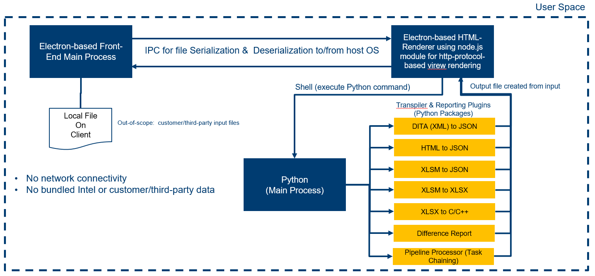
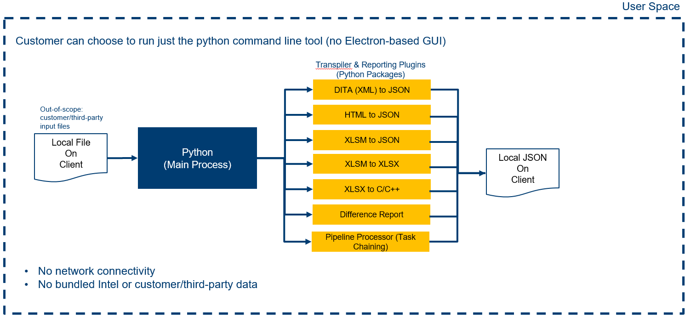

# Architectural Design
The plugin based architecture is based on an article [here](https://pythonhowtoprogram.com/a-plugin-architecture-for-using-importlib-in-python-3/)

## GUI architecture

## CLI architecture

