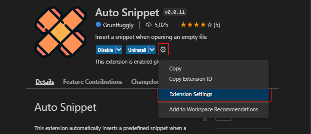
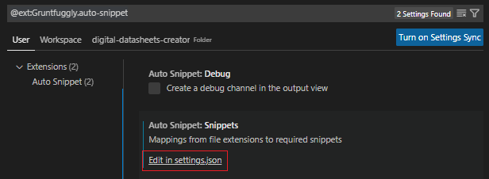
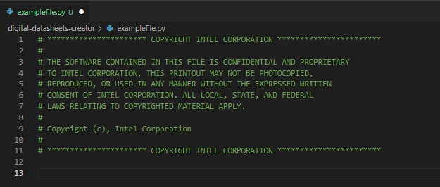

# Developer Setup
1. [Download](https://git-scm.com/download/win) and install git
2. [Download](https://code.visualstudio.com/Download) and Install Visual Studio Code
3. Within Visual Studio Code, install python and json marketplace extensions using the "Extensions" button in the left nav bar.
4. As of date of publishing this guide, python 3.11 is the latest python distribution available [Download](https://www.python.org/downloads/) and Install Python 3.11 
5. [Download](https://www.geeksforgeeks.org/download-and-install-pip-latest-version/#windows) and Install PIP for Windows

> ⚠️ Warning
> 
> Please check your environment variables if you are using Windows.

6. If developing on Windows, [download](https://mlocati.github.io/articles/gettext-iconv-windows.html) and install the appropriate gettext and iconv binaries for your platform to produce localized strings.   For ease of configuration the [64-bit static library](https://github.com/mlocati/gettext-iconv-windows/releases/download/v0.21-v1.16/gettext0.21-iconv1.16-static-64.exe) is preferred since the tools can be easily relocated on your system if needed.  
7. Install Python Virtual Environments with this command:
    ```
    pip install virtualenv
    ```
8. Create a source directory and cd into that directory.  Example:
    ```
    mkdir <directoryname>
    cd <directoryname>
    ```
9.  Clone the source repository with this command:
    ```
    git clone https://IntelAdvantage@dev.azure.com/IntelAdvantage/E-Datasheet-Collateral/_git/digital-datasheets-creator
    ```
    
5.  Set up a virtual environment Within the project directory type:
    ```
    python3 -m venv .venv
    ```
    This will create a virtual directory for the project where external package dependencies will be installed.  There is some good documentation on using virtual environments [here](https://www.geeksforgeeks.org/creating-python-virtual-environment-windows-linux/).  Visual Studio should recognize the virtual environments
6.  cd into the repository directory
7.  Now you need to activate your virtual environment for this you should run the following command:
    ```ps
    ".venv/Scripts/activate"
    ```
8.  Install the package dependencies using this command:
    ```ps1
    pip install -r requirements.txt
    ```
9.  Using Visual Studio Code, open the digital-datasheets-creator.code-workspace file
10. Create a new Terminal window by clicking on "Terminal + New Terminal" menu items or:
    ```
    Ctrl+Shift+`
    ```
11. For Windows, cd into the edatasheets_creator directory and type:
    ```
    py main.py 
    ```
    You should get an input file not found error because no command line arguments were specified.  That's OK, just confirms that the environment is set up correctly

12. Set up a launch.json file for debug by pressing the Run and Debug button on the left nav bar in Visual Studio Code and creating a launch.json if one does not already exist.  Here is an example launch.json (don't forget to change the paths to point to a sample file)
    ```json
    {
        // Use IntelliSense to learn about possible attributes.
        // Hover to view descriptions of existing attributes.
        // For more information, visit: https://go.microsoft.com/fwlink/?linkid=830387
        "version": "0.2.0",
        "configurations": [
             
            {
                "name": "Python: Current File",
                "type": "python",
                "request": "launch",
                "program": "${workspaceFolder}/edatasheets_creator/main.py",
                "console": "integratedTerminal",
                "justMyCode": true,
                "args": [
                    "--f",
                    "C:/Users/rehall/Downloads/GPIO/input.xlsx",
                    "--m",
                    "C:/Users/rehall/Downloads/GPIO/input-map.json"
                ]
            }
        ]
    }
    ```

# Auto Header
According to requirements, a copyright header must be included for each code that we develop in this project. To make this easy, we use a Snippet extension in VSCODE (Auto Snippet) that includes the header on creation of a new python file. To configure the plugin, the below steps are used:

1. Go to File -> Preferences -> Configure User Snippets.
2. Search python and click on it.
3. In that json file, include the following object
   ```json
   "intel-copyright": {
            "prefix": "intel",
            "body": [
                "# ********************** COPYRIGHT INTEL CORPORATION ***********************",
                "#",
                "# THE SOFTWARE CONTAINED IN THIS FILE IS CONFIDENTIAL AND PROPRIETARY",
                "# TO INTEL CORPORATION. THIS PRINTOUT MAY NOT BE PHOTOCOPIED,",
                "# REPRODUCED, OR USED IN ANY MANNER WITHOUT THE EXPRESSED WRITTEN",
                "# CONSENT OF INTEL CORPORATION. ALL LOCAL, STATE, AND FEDERAL",
                "# LAWS RELATING TO COPYRIGHTED MATERIAL APPLY.",
                "#",
                "# Copyright (c), Intel Corporation",
                "#",
                "# ********************** COPYRIGHT INTEL CORPORATION ***********************"
            ]
        }
   ```
4. Now, install the extension Auto Snippet (```ID: Gruntfuggly.auto-snippet```), then click on extension settings.


1. Then click on ```Edit in settings.json```
   
   

2. Add the following element to the array ```autoSnippet.snippets```

  ```json
  {
      "pattern": "**/digital-datasheets-creator/**/*.py",
      "snippet": "intel-copyright"
  }
  ```

  

Once you have all these settings, create a new python file in the project, and if everything is configured correctly, you should see something like the following:

