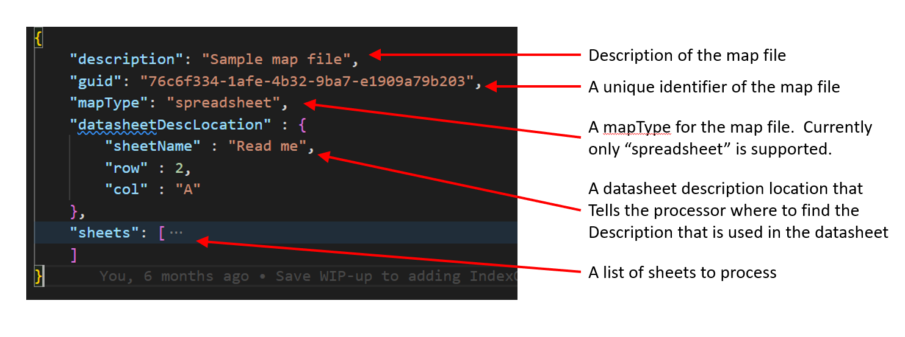
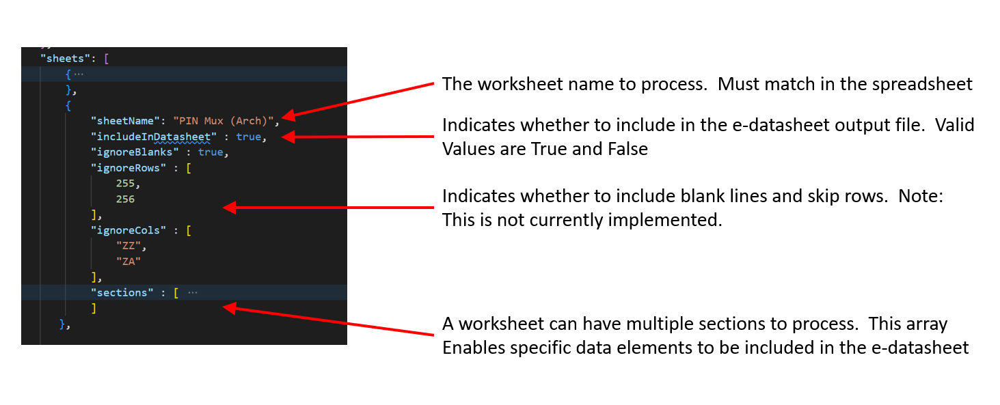
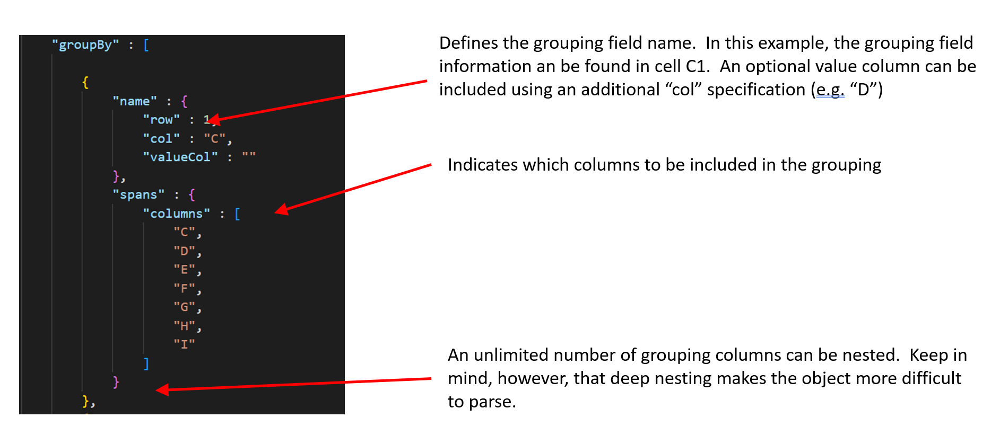

# Running the App
Invoke with:
python3 main.py --f [dir]]sample_data.xlsx --m [dir]/sample_map.json

## Translating Datasheets
This application includes a feature that enables translating datasheets from one vocabulary to another.  This is invoked with the 

```ps1
--vocabulary
```
command line switch, and the argument passed after the flag indicates the target vocabulary file.  This file can live anywhere, but must be referenced as a parameter

Example invocation:

```ps1
python3 main.py --f "C:/Users/myuserid/Downloads/sample_data.json" --vocabulary "C:/Users/myuserid/Downloads/vocabularies/iec61360/vocabulary.json"
```

### How It Works
1. The translator plugin loads the specified vocabulary
1. The JSON input file is read recursively and each key is checked against the vocabulary values
1. If the input key is found in any of the vocabulary values, the key in the document is translated to the new key value found in the vocabulary file
1. The input file is rewritten using the translated keys

### Sample Vocabulary File
Following is a sample vocabulary file

```json
{
    "guid" : "1994225a-c7f8-4b1a-983d-2fff1dcdab62",
    "specification" : "IEC 61360-4",
    "description" : "IEC 61360 Part 4 Vocabulary File",
    "uri" : "https://cdd.iec.ch/cdd/iec61360/iec61360.nsf/TreeFrameset?OpenFrameSet",
    "automationUri" : "https://cdd.iec.ch/cdd/iec61360/iec61360.nsf/TU0/",
    "vocabulary" : [ 
            {
                "code" : [
                    "theCode"
                ]
            },
            {
                "definition" : [
                    "definitionEn",
                    "definitionEs"
                ]
            },
            {
                "translated" : [
                    "testTranslatedEn"
                ]
            },
                {
                "preferredname" : [
                    "preferredNameEn"
                ]
            },
            {
                "shortname" : [
                    "shortnameEn",
                    "shortnameEs"
                ]
            }
    ]
}
```
## Localization Tips
This application supports internationalization (i18n).   There are several helpful articles that explain i18n:

1. [How to Translate a Python Project With Gettext the Easy Way](https://simpleit.rocks/python/how-to-translate-a-python-project-with-gettext-the-easy-way/)
1. [How to Fill In the Header Entry in the PO file](https://www.gnu.org/software/gettext/manual/html_node/Header-Entry.html)
1. [Python Documentation](https://docs.python.org/3/library/gettext.html)
1. [gettext - Message Catalogs](https://pymotw.com/2/gettext/)
1. [Stackoverflow on a common error](https://stackoverflow.com/questions/3837683/python-no-translation-file-found-for-domain-using-custom-locale-folder)


## Adding Localized Strings
Note that this is required only if new strings are added to the code that need to be translated.  This is not part of the setup instructions
1. Add code to your __init__.py or other module:
    ```python
    current_locale, encoding = locale.getdefaultlocale()
        
    locale_path = 'locales/'
    
    translate = gettext.translation('base',localedir=locale_path,languages=['en_US'])
    translate.install()
    _ = translate.gettext
    print(_('Starting Application'))
    ```
    
1.  Generate POT from source:
    ```ps1
    xgettext -d base -o locales/base.pot main.py
    ```

1.  Copy the base.pot file to each of the locale specific subdirectories:

    ```ps1
    cp locales/base.pot locales/en_US/LC_MESSAGES/base.po
    ```

1.  Edit each of the po files in the locale-specific subdirectories:

    - Change CHARSET to UTF-8 (for most languages)
    - Edit each string in a locale-specific language

1.  Compile each po file into locale-specific binary:
    ```ps1
    msgfmt -o locales/en_US/LC_MESSAGES/base.mo locales/en_US/LC_MESSAGES/base
    ```

Alternatively, a single "messages" file can be created and strings added to the POT file, then execute the following command to compile the messages file:
    ```
    msgfmt -o locales/en_US/LC_MESSAGES/messages.mo locales/en_US/LC_MESSAGES/messages
    ```
Be sure to first delete the existing messages file or else run with the --update flag


## Generating Documentation

# Build and Test
Invoke with:
python3 main.py --f [dir]/sample_data.xlsx --m [dir]/sample_map.json --t [dir]/job-file.json


# Documentation

Documentation is generated via sphinx

## E-Datasheet Format

The e-datasheet has some fields which are required in the output file depending on the plugin being used. The following subsection show what fields will be entered in the corresponding output file for each file type.

### DITA (XML)

#### Included Fields in Output

1. namespace: Static field to with the URL of Intel Design, Value: https://www.intel.com/design
1. generatedOn: Date of generation of the datasheet with format YYYY-MM-DDTHH-MM-SS.
1. generatedBy: Team that generates the datasheet, in this moment all of this files are generated by e-datasheet team, and for that reason is a static field, Value: Intel e-Datasheet Generator.
1. inputFile: File where was used to generate the datasheet, include the GUID and the extension of the file.
1. platformAbbreviation: Supported platform for this datasheet, ex: ADL.
1. skuAbbreviation: Supported segment/sku abbreviation for this datasheet, ex: P.
1. revision: Revision number reported in RDC when publishing the collateral.
1. collateral: Collateral name or abbreviation for this document.
1. title: Main title that explain the contents of this datasheet.
1. guid: Unique Identifier of the datasheet, needs to match with the name of the file name of the datasheet and the input file.
1. tables: List that contains the tables information, in this case all the formats depends on the input format.
1. attachments: List that contains the attached files to the different input files. The attached files could be, images, diagrams, dita file and any other files.

```json
{
  "datasheet": {
    "namespace": "https://www.intel.com/design",
    "generatedOn": "2023-02-20T15:20:48",
    "generatedBy": "Intel e-Datasheet Generator",
    "inputFile": "GUID-12345678-ABCD-EFGH-IJKL-1234567890AB.xml",
    "platformAbbreviation": "ADL",
    "sku": "P",
    "revision": "1.0",
    "collateral": "PDG",
    "title": "e-Datasheet of example",
    "guid": "12345678-ABCD-EFGH-IJKL-1234567890AB",
    "tables": [],
    "attachments": []
  }
}
```

#### Special Fields

##### Attachments

This field needs to follow an specific format because is required to be uploaded in Platform Model. Each attachment must include the title of the file with the extension of the file, the mimetype of the file and the reference ID of the file.

```json
{
    "attachments": [
      {
        "reference": "b792be9b-049c-4496-a4a4-ed9aa6a5a238",
        "type" : "image/png",
        "name": "Attachment of example.png"
      }
    ]
}
```

### XLSX

#### Included Fields in Output

1. title: Title of the datasheet.
2. description: Description of the contents of this datasheet.
3. inputFile: File where was used to generate the datasheet, include the GUID and the extension of the file.
4. createdOn: Date of generation of the datasheet with format YYYY-MM-DD-HH-MM-SS.
5.  guid: Unique Identifier of the datasheet, needs to match with the name of the file name of the datasheet and the input file.

### C-Header , C-Lang

#### Included Fields in Output

1. title: Title of the datasheet.
2. description: Description of the contents of this datasheet.
3. inputFile: File where was used to generate the datasheet, include the GUID and the extension of the file.
4. createdOn: Date of generation of the datasheet with format YYYY-MM-DDTHH-MM-SS.
5.  guid: Unique Identifier of the datasheet, needs to match with the name of the file name of the datasheet and the input file.

### HTML TO JSON

#### Included Fields in Output

1. title: Title of the datasheet.
2. description: Description of the contents of this datasheet.
3. inputFile: File where was used to generate the datasheet, include the GUID and the extension of the file.
4. createdOn: Date of generation of the datasheet with format YYYY-MM-DDTHH-MM-SS.
5.  guid: Unique Identifier of the datasheet, needs to match with the name of the file name of the datasheet and the input file.


## Generating HTML docs

The command to generate the html documentation is:

```
sphinx-apidoc -o docs digital-datasheets-creator
```

then change directory to the docs directory and issue the following command:

```
make clean html
```


## Callgraph Generation
The callgraph diagram generation is based on this article:
[How to Automatically Create Project Graphs with Call Graph](https://www.statworx.com/en/content-hub/blog/how-to-automatically-create-project-graphs-with-call-graph/)

The command to generate the callgraph included in project documentation is:

```ps1
project_graph -a -m 1 "main.py --f /home/rehall/Downloads/sample_data.xlsx --m /home/rehall/Downloads/sample-map.json"
```

## Translators, Code Generators
C Header File
clangheader.py
This file takes in a json file and outputs a C language header file

C File
clangfile.py
This file takes in a json file and outputs a C language file
## Spreadsheet Processing
The application has the ability to read spreadsheets and produce JSON datasheets as output.   This functionality is captured in the spreadsheet.py module.  Included in the spreadsheet processing is the ability to "map out" or extract parts of the sheets within the workbook.  This focused extraction happens via map files.

### Map Files
Map files may be used to capture specific parts of a workbook.   These map files are implemented as JSON files and a brief introduction to their structure and usage follows.   Map file examples can be found in the maps folder within the application.

#### Overview of a Map File



Each worksheet within a workbook can include special processing rules



Next, each section will need to be described.  Sections are defined within the scope of a sheet item.  Subsets of each worksheet can be shaped using the language described here:


JSON object data can also be grouped under other column values.   A JSON object will be constructed under the specified group by columns.  These groupings are defined within a section object and produces JSON that is shaped like this:

    {
        groupByFieldName: [
            jsonObject: {
                dataFieldName1: 1,
                dataFieldName2: "A String
            }
        ]
    }




## Plugins with Multiple Arguments
This is an implementation introduced with the Directory Listing plugin, which allows the app to support more than 3 arguments of any type that the plugin needs.

For a specific plugin to be able to use this option, the keyword `validateInputs` needs to be set to false in the plugin_cfg.json definition for the plugin. You also need to define the caseFormats that specify the type and default value for each argument in the case list.

When using this functionality, ensure that your plugin class inherits from PluginBase class. This base class adds the validation schema for input arguments to the plugin. The validation uses the marshmallow library that converts complex data types to native Python data types and vice versa.

To validate the schema, a schema definition is created. An example of the schema for Directory Listing plugin that contains a dir1 and output arguments is shown below. In the input of the plugin you receive a dictionary with these arguments. To check methods available for the fields in marshmallow please visit the [webpage](https://marshmallow.readthedocs.io/en/stable/).

```python
from marshmallow import Schema, fields, validate

class DirectoryListingSchema(Schema):
    """Input Schema definition
    """
    dir1 = fields.Str(required=True, validate=validate.Length(min=1, error="directoryInput can't be empty"))
    output = fields.Str(required=True, validate=validate.Length(min=1, error="output can't be empty"))

```

In the plugin definition, you need to specify the defined schema in the INPUT_SCHEMA variable and  initialize the parent class using the `super().__init__()` method, as shown below:

```python
class Plugin(PluginBase):
    """Directory Listing Plugin to read dita files in a directory,
    using base plugin to validate input schema.
    """
    INPUT_SCHEMA = DirectoryListingSchema

    def __init__(self) -> None:
        super().__init__()
```

# Main running modules
In the software, there are two main files in charge of the total execution of the functionalities. These are:
1. Core.py: In charge of command line argument parsing and single plugin task creation with single file inputs and one output.
2. Runner.py: Parsing of Pipeline jobs for multiple plugin executions for one or multiple files and execution of all the tasks in the system.


## Core
This is the first executable module called from main. It performs the following action:

### Command line flag argument inputs parsing
The program will define the operations/plugin to execute depending on the input flags. The available command line flags are:
1. --f: Input file path for the operation to be executed.
2. --fpdg: Input file path for the operation to be executed for certain kinds of DITA files
3. --m: Map file path for operations that requires it.
4. --o: Defines the name and path of the file that is produced after an operation.
5. --t: Value that indicates if a C header file (header) or C source (c) file will be produced.
6. --p: Path to a Pipeline.json file to automate multiple task execution.
7. --vocabulary: Vocabulary file path for operations that requires it.
8. --diff1: First file that will be compared.
9. --diff2: Second file that will be compared.
10. --fixup: Specifies the map file for the fixup plugin.


Examples:

Executing a Pipeline job file:
```ps1
python3 main.py --p "C:/Users/user/jobs/pipelineJob.json"
```

Produce a JSON file from XLSX:
```ps1
python3 main.py --f "C:/Users/user/GPIO_Impl_Summary_Rev0p91.xlsx" --m "C:/Users/user/maps/641238_MTL_UPH_UType4_GPIO_Impl_Summary_Rev0p91-map.json"
```

Produce a C header file from JSON:
```ps1
python3 main.py --t header --f "C:/Users/user/GPIO_MAPPING_WW39.4.Raj_modified.json" --m "C:/Users/user/GPIO_MAPPING_Rev0p8_WW52P3-map.json"
```

Produce XLSX file from XLS:
```ps1
python3 main.py --f "C:/Users/user/export_LISTOFUNITS_TSTM-CGVQHZ-Lists-of-Units.xls" --o "C:/Users/user/export_LISTOFUNITS_TSTM-CGVQHZ-Lists-of-Units.xlsx"
```

Produce difference report form two JSON files:
```ps1
python3 main.py --diff1 "C:/Users/user/difftest1_1.json" --diff2 "C:/Users/user/difftest2_1.json"
```

If a Pipeline file is not detected, the values specified from the console will be stored on class arguments for the task creation process. Otherwise, the input file path is sent to the runner for parsing operations.

### Creation of tasks
In this phase, the system creates Task objects (executable units that the Runner is able to process) with the data retrieved from the command line flag arguments. A plugin will be assigned to each task created depending on the input file type, output file type and flags used.

### Triggering the task execution
The Core module is not responsible of execution of tasks, so it calls the execution methods from the Runner once the task creation is done.

## Runner
This module is called from Core to execute two different tasks:
1. Parse and execute pipeline input files
2. Process Tasks created by Core

### Pipeline files parsing
The Runner receives the path to a Pipeline.json file. The Runner creates a Parser instance to create a list of one or multiple Job objects (element that can group one or multiple tasks).

### Jobs and tasks execution
Once the run method is invoked by the Core module, the Runner will process the list of Jobs and Tasks that were parsed from the Pipeline file or created by Core. If there are multiple Jobs or Tasks, the Runner will iterate over them one by one. In the Pipeline.json file is specified the order of each Job and Task execution.

### Input file and output path existence
The Runner will prevent the execution of a Task if the input files or the output path do not exist. It will indicate which files or paths were not found.

# Pipeline
Pipeline files allow the execution of multiple Jobs and Tasks over individual files or over directories and its subdirectories. The process to create individual file or directories executions is the following:

## Individual files
On the input, output, map and vocabulary parameters include the full path to the files that will be used and generated. As an example:

```json
{
  "pipelineDescription":"Automate form xls to edatasheet",
  "pipelineJobs":[
    {
      "description": "Translation of XLSX",
      "jobID":1,
      "jobTasks": [
        {
          "taskID" : 1,
          "description": "XLSX to json with map",
          "taskGUID": "a8a799ed-969a-4c77-b21b-bf9b77461037",
          "map": "C:/Users/User/Downloads/Maps/map1.json",
          "vocabulary":"",
          "arg1": "C:/Users/User/Downloads/InputFiles/spreadsheet.xlsx",
          "arg2": "",
          "output": "C:/Users/User/Downloads/Outputs/Spreadsheet/spreadsheet.json"
        }
       ]
    }
   ]

```

Only the specified input file will be processed using the defined vocabulary/map file and will produce the output with the given name.

## Directory execution
On the input, output, map and vocabulary parameters include the full path to the directory that contains the files . As an example:

```json
{
  "pipelineDescription":"Automate form xls to edatasheet",
  "pipelineJobs":[
    {
      "description": "Translation of XLSX",
      "jobID": 1,
      "jobTasks": [
        {
          "taskID" : 1,
          "description": "XLSX to json with map",
          "taskGUID": "a8a799ed-969a-4c77-b21b-bf9b77461037",
          "map": "C:/Users/User/Downloads/Maps/",
          "vocabulary":"",
          "arg1": "C:/Users/User/Downloads/InputFiles/",
          "arg2": "",
          "output": "C:/Users/User/Downloads/Outputs/Spreadsheet/"
        }
       ]
    }
   ]

```

The program will look for valid input extensions defined by the configuration of the plugin. Other file types present in the directory will be ignored. If the input folder path has subdirectories, files in those folders will be processed and the outputs placed in the same path as the parent directory outputs.

Map and vocabulary file search will be done in the path provided on the Task "map" or "vocabulary" keys respectively. In order to match the map or vocabulary .json files, the naming must follow the next rules:

1. For map files: These files need to have the same name of the input file, plus the "_map" suffix. Example: Input file "speadsheet.xlsx", map file "speadsheet_map.json"
2. For vocabulary files: These files need to have the same name of the input file, plus the "_vocabulary" suffix. Example: Input file "speadsheet.json", vocabulary file "speadsheet_vocabulary.json"


## Directory execution with one map
Only on the map or vocabulary parameter, a single file will be specified. In the other arg1, arg2 and output parameters, paths to the files that will be processed and directory for the outputs to be placed need to be specified.
```json
{
  "pipelineDescription":"Automate form xls to edatasheet",
  "pipelineJobs":[
    {
      "description": "Translation of XLSX",
      "jobID": 1,
      "jobTasks": [
        {
          "taskID" : 1,
          "description": "XLSX to json with map",
          "taskGUID": "a8a799ed-969a-4c77-b21b-bf9b77461037",
          "map": "C:/Users/User/Downloads/Maps/map.json",
          "vocabulary":"",
          "arg1": "C:/Users/User/Downloads/InputFiles/",
          "arg2": "",
          "output": "C:/Users/User/Downloads/Outputs/Spreadsheet/"
        }
       ]
    }
   ]

```

## Directory execution with multiple arguments of any type
When the validateInputs flag is set to False, it allows the option to use the multi-argument function, which allows the arguments to be of any type other than a file. For example, Directory Listing plugin, expect a directory as an input, and to avoid this the plugin configuration has the validateInputs flag set to False.

Also if this options is disabled, you need to specify the caseFormats object, because here you are not using the default arguments. This is the example for the Directory Listing Plugin.
```json
{
    "label": "Directory Listing",
    "pluginName": "directory_listing",
    "description": "Replace with description",
    "pluginGUID": "3bf4ede9-9ede-4883-aca6-6cc7876e3ded",
    "case": ["dir1", "output"],
    "caseFormats": {
        "dir1": {
            "type": "directory"
        },
        "output": {
            "type": "file",
            "default": "dita_directory_listing.json"
        }
    },
    "inputFormats": [""],
    "outputFormat": "json",
    "validateInputs": false
}
```

# Plugin Specification Data
Plugins use a configuration file to facilitate the addition of new functionalities to the system. This file is located in edatasheets_creator/setting/plugin_cfg.json. The plugins will have several attributes that are:

1. pluginName: Name of the plugin
1. description: Describes what the plugin does
1. pluginGUID: unique identifier for the plugin
1. case: Each plugin supports 3 parameters in the "process()" function, this array indicates which keys from the task will correspond to each of those parameters.
1. inputFormats: List of formats that the plugin support as inputs. This will only be used in Pipeline directory execution.
1. outputFormat: Format of the output produced by the plugin. This will only be used in Pipeline directory execution.
1. validateInputs: Flag to control file validation step, defaults to True (also if not defined), but if set to False, skips file validation and allows option to use multiple argument function (for any Type).
1. caseFormats: Object to specify the type and default value for case arguments, only available when validateInputs is set to False.

An example of the plugins configuration file is:

```json
[
    {
        "pluginName": "diff",
        "description":"Generates the html difference report",
        "pluginGUID":"6efd8af2-ea34-49f4-826c-a2ad45595c5f",
        "case":["arg1", "arg2", ""],
        "inputFormats":["json"],
        "outputFormat":"html"
    },
    {
        "pluginName": "spreadsheet",
        "description":"Spreadsheet plugin class that implements datasheet generation from an XLSX",
        "pluginGUID":"a8a799ed-969a-4c77-b21b-bf9b77461037",
        "case":["arg1", "output", "map"],
        "inputFormats":["xlsx"],
        "outputFormat":"json"
    },
    {
        "label": "Directory Listing",
        "pluginName": "directory_listing",
        "description": "Replace with description",
        "pluginGUID": "3bf4ede9-9ede-4883-aca6-6cc7876e3ded",
        "case": ["dir1", "output"],
        "caseFormats": {
        "dir1": {
            "type": "directory"
        },
        "output": {
            "type": "file",
            "default": "dita_directory_listing.json"
        }
        },
        "inputFormats": [""],
        "outputFormat": "json",
        "validateInputs": false
    }
    ...
]
```


Depending if the execution is for a Pipeline.job file or files indicated from the command line arguments, the system will link the corresponding plugin in the following ways:

## Command line arguments
After validation of the command line arguments inputs, Core.py will link the plugins by accessing the configuration file plugin list using indexes. These indexes are defined as constants in edatasheets_creator/constants/pluginconstants.py. Every time a new plugin is created, it is required to add a new constant index to represent the plugin as follows:

In pluginconstants.py:
```python
#Plugins indexes
CLANG_HEADER_INDEX = "dbbb4b96-3142-4a1f-9002-2ab857ed0f0d"
DEFAULT_INDEX = "28d1491d-b368-49a0-a9ac-9ed2d917171d"
DIFF_INDEX = "6efd8af2-ea34-49f4-826c-a2ad45595c5f"
SPREADSHEET_INDEX = "a8a799ed-969a-4c77-b21b-bf9b77461037"
TRANSLATOR_INDEX = "3034c0e7-782a-4c39-8b4b-fb400a4c2063"
XLSM_TO_XLSX_INDEX = "69909873-c30a-4961-bd2a-b057054e3b62"
XLS_TO_XLSX_INDEX = "31880d5a-641f-4a56-a2d6-8ff852698e7a"
CLANG_FILE_INDEX = "3060d9b5-a170-4469-b43b-56746036a7e8"
DATASHEET_TO_XLSX = "39794f7f-43c8-4156-a920-f718ed9b18df"
DITA_TO_JSON = "7696d6b4-fb25-4917-8fd9-2958f0f1a47a"
FIXUP_INDEX = "9289a2cf-7e17-4d36-8f18-186ecadbbe07"
```


## Pipeline.job file
On the pipeline definition file, inside each job and inside each task, there will be a defined "taskGUID" key. This key value must match to one of the "pluginGUID" defined in the edatasheets_creator/setting/plugin_cfg.json configuration file. This way, the system will execute the task for the defined task inputs.

An example of a pipeline file is:
```json
{
  "pipelineDescription":"Automate form xls to edatasheet",
  "pipelineJobs":[
    {
      "description": "Translation of XLSX",
      "jobID":1,
      "jobTasks": [
        {
          "taskID" : 1,
          "description": "XLSX to json with map",
          "taskGUID": "a8a799ed-969a-4c77-b21b-bf9b77461037",
          "map": "C:/Users/Maps/map.json",
          "vocabulary":"",
          "arg1": "C:/Users/InputFiles/spreadsheet.xlsx",
          "arg2": "",
          "output": "C:/Users/Outputs/Spreadsheet/spreadsheet.json"
        }
      ]
    }
   ]
}
```

# Building executable file
In order to create an executable file from the source code, the cx_Freeze library is used. 

The install  procedure for cx_Freeze is: run the following command inside the virtual environment:
```
pip install --upgrade cx_Freeze
```

To create a build of the code, a setup.py file is needed. This file contains:

1. Packages build option: Python packages that are imported inside the code. It is important to include the plugin package, as the plugins are dynamically linked during run time of the application.
2. Include files build option: This are all the auxiliary files and folders that will be included with the build of the executable files.
3. Base: As the application is console based, None is implemented.
4. Target: This is the python file that starts the application (the main).
5. setup() method call: This method is used to specify the application name, version, author, option and executables for the executable being build.

An example of the file is shown bellow:

```python
from cx_Freeze import setup, Executable
import sys


packages = ['sys', 'gettext', 'locale', 'os', 'json', 're', 'uuid', 'inspect', 
            'jsonpath_rw_ext', 'conf_diff', 'xlsxwriter', 'pathlib', 'urllib',
            'bs4', 'datetime', 'genson', 'xml', 'typing', 'inspect', 'openpyxl',
            'logger', 'pandas', 'string',
            'plugins']


includes = [
      "./incoming/",
      "./locales/",
      "./schemas/",
      "./settings/",
      ]

# Dependencies are automatically detected, but it might need fine tuning.
build_exe_options = {
	"packages": packages, # required packages
	"include_files" : includes
}

#A CMD application
base=None 

#Main target file
target_main = "./main.py"

setup(name = "TestApp",
      version = "0.1",
      description = "Tool description",
      author = "Author",
      options = {"build_exe": build_exe_options},
      executables = [Executable(target_main, base=base)]
     )
```

To invoke the build process, execute the command below in the same path containing the setup.py file:

```
python setup.py build
```

As a result, a "/build" folder will be created in the project. Inside the "/build" folder, one or more sub-folders will be present. This is because cx_Freeze supports multiple build control and it will create one executable folder for windows and one for linux. An important factor to note is that cx_Freeze does not support cross platform building. This means that the build executable will only work on the OS it has been created (Windows or Linux).

```
edatasheets_creator/
 | - main.py
 | - setup.py
 | - build/
 |    | - exe.win-amd64-3.10
 |    | - exe.linux-x86_64-3.10
```

To run the application from the executable, it is necessary to create a console located at the output folder from the build. Once placed in the output folder, just call the executable with the parameters to operate as shown depending on the platform:

## Windows
```
main.exe --diff1 "C:/Users/Downloads/difftest1_1.json" --diff2 "C:/Users/Downloads/difftest2_1.json"
```
## Linux
```
./main --diff1 "C:/Users/Downloads/difftest1_1.json" --diff2 "C:/Users/Downloads/difftest2_1.json"
```